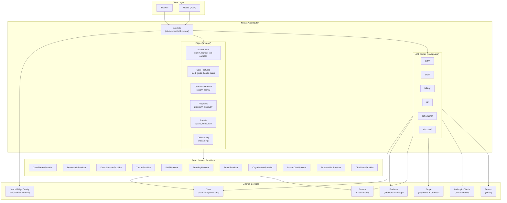
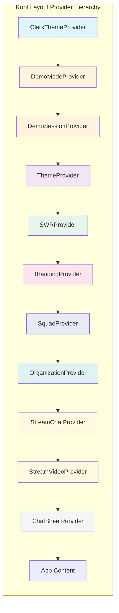
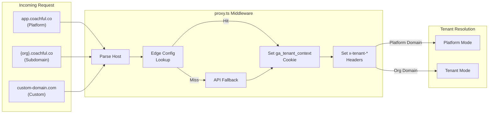
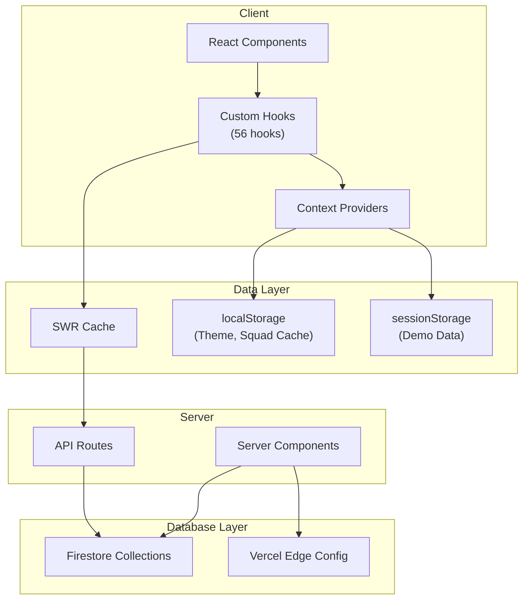
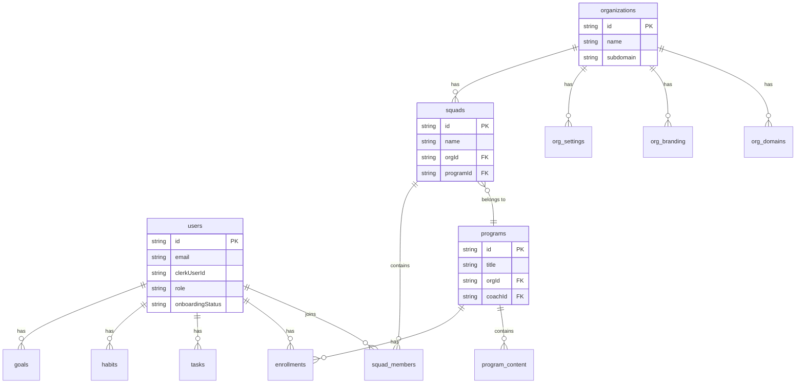
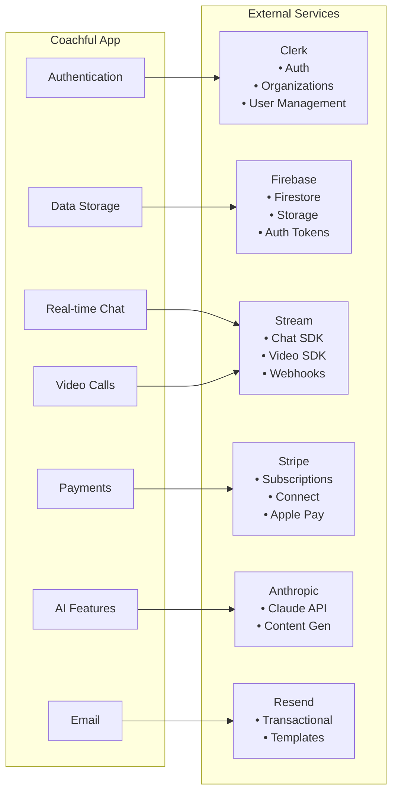
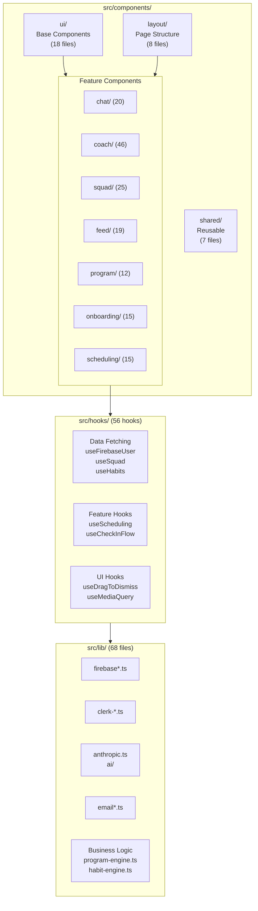
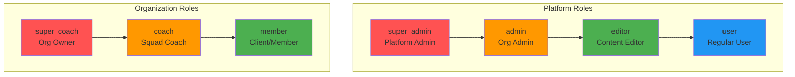

# Coachful Architecture

This document provides visual diagrams of the Coachful codebase architecture using Mermaid.js.

## System Architecture Overview

## Provider Hierarchy

The React context providers are nested in this specific order in `src/app/layout.tsx`:

## Multi-Tenancy Flow

Tenant resolution happens in the middleware (`src/proxy.ts`):

## Data Flow Architecture

## Firestore Collections

## External Service Integration

## Component Architecture

## User Roles & Permissions

---

## Summary

Coachful is a **multi-tenant SaaS coaching platform** with:

| Metric | Count |
|--------|-------|
| Page routes | 37+ |
| API endpoints | 60+ |
| Context providers | 11 |
| Custom hooks | 56 |
| Lib utilities | 68 |
| External services | 6 |

**Key Technologies:**
- **Framework:** Next.js 16+ with App Router
- **Auth:** Clerk (multi-tenant organizations)
- **Database:** Firebase Firestore
- **Real-time:** Stream Chat & Video
- **Payments:** Stripe with Connect
- **AI:** Anthropic Claude
- **Email:** Resend
